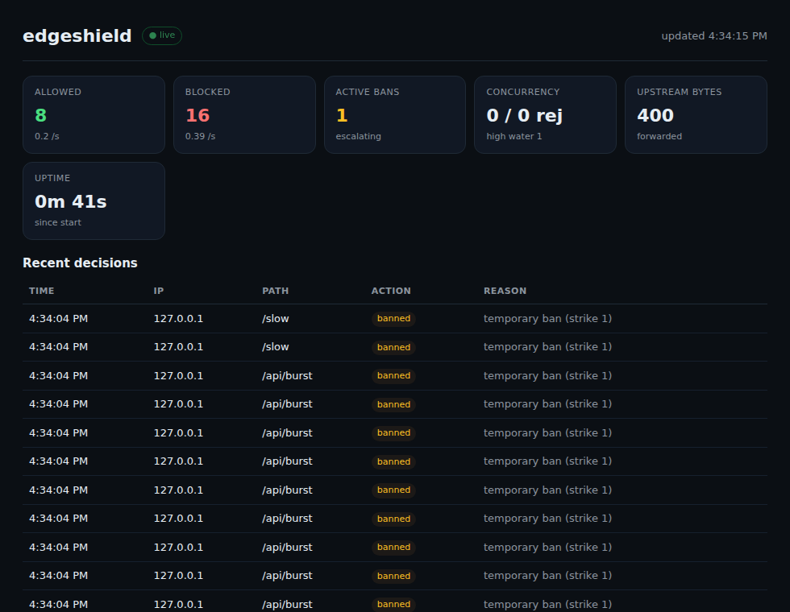

# edgeshield

Local-first reverse proxy shield for small services. Sits in front of your app and filters traffic before it reaches the origin: per-IP rate limiting with auto-ban escalation, concurrency cap, slowloris timeout, request size caps, and a small rule engine. Zero dependencies, Node 18+.

This is the defensive half of a portfolio: [GP-1](https://github.com/Gopyr/GP-1) measures how a service behaves under load; edgeshield keeps a service alive when the load is hostile.

## What it stops

| Attack shape | Defense | Status code |
|---|---|---|
| Botnet flood from many IPs | Per-IP token bucket (burst + refill) | 429 |
| Repeated abuse from one IP | Auto-ban with escalation tiers (1m → 5m → 15m) | 429 |
| Connection flood / slowloris | `headersTimeout` + `requestTimeout` on the proxy socket | 408/close |
| Path/product abuse (scraping, admin probing) | Rule engine: block by path, method, user-agent, IP, CIDR | 403 |
| Oversized bodies / pathological URLs | `maxBodyBytes`, `maxPathLen` | 413 / 414 |
| Parallel overload on origin | Concurrency gauge (in-flight cap) | 503 |
| Direct-to-origin probing | Shield is the only entry; origin binds loopback | n/a |

## Install

```bash
npm install -g .
# or run without global install
node src/cli.mjs --config config.example.json
```

## Usage

```bash
edgeshield --config config.json
edgeshield --target 127.0.0.1:3000 --port 8080    # bare defaults
edgeshield --block-ip 1.2.3.4 --config config.json # temporary manual block
```

Start a target on `127.0.0.1:3000`, point the shield at it, and route traffic through the shield port instead. The origin stays on loopback so direct probing fails at the network layer.

## Dashboard

While running, open `http://localhost:8080/__shield` for a live dark-theme dashboard (polls every 2s, no external assets): allowed/blocked counters, active bans, concurrency high-water, forwarded bytes, and a recent decisions table showing exactly why each request was blocked. No telemetry leaves the machine.



Example from a real attack simulation (burst of requests from one client):

```text
normal request passes      ✔
sensitive path blocked      ✔ (403)
concurrency cap rejects     ✔ (503)
6th request rate-limited    ✔ (429)
auto-ban activated          ✔ (bans.active=1)
```

## Config

See [`config.example.json`](config.example.json):

```jsonc
{
  "target": { "host": "127.0.0.1", "port": 3000 },
  "listen": { "host": "0.0.0.0", "port": 8080 },
  "rate": { "perIp": { "capacity": 60, "refillPerSec": 10 } },
  "window": { "maxPerWindow": 2000, "windowMs": 60000 },
  "concurrency": { "max": 100 },
  "slowloris": { "headerTimeoutMs": 8000, "requestTimeoutMs": 15000 },
  "maxBodyBytes": 1048576,
  "maxPathLen": 512,
  "trustProxy": false,
  "ban": { "tiersMs": [60000, 300000, 900000], "forgetMs": 600000 },
  "rules": [
    { "action": "block", "match": { "path": ["/admin", "/config", "/.env"] }, "reason": "sensitive path blocked" },
    { "action": "allow", "match": { "ip": ["127.0.0.1"] }, "reason": "localhost always allowed" }
  ]
}
```

Rules support `ip`, `cidr`, `path` (exact or `*` suffix), `method`, `userAgent` (regex), and `query` (key or key=value). First matching rule wins.

## How it works

1. `Shield.evaluate()` runs in order: ban check → rules → path length → body size → per-IP token bucket → global window → concurrency gauge.
2. A rate-limit violation triggers `BanManager.strike(ip)`: consecutive violations within `forgetMs` escalate the ban duration through tiers.
3. Allowed requests proxy to the target with `http.request`; upstream errors return 502.
4. `/__shield` and `/__shield/stats` are served by the shield itself and never proxied.

## Limitations

- Single process, single origin. Not a load-balanced edge (use nginx/cloudflare in front if you need that).
- In-memory state only: bans and buckets reset on restart.
- No TLS termination, no HTTP/2, no WebSocket proxying.
- `trustProxy` trusts the `X-Forwarded-For` header blindly; only enable behind a trusted proxy.
- Token bucket per-IP state is capped at 10k entries; beyond that the oldest buckets are dropped.
- This is a shield for small services, not a WAF. It throttles and blocks based on shape, not on payload content.

## Development

```bash
npm test        # unit: limiters, rules
node test/integration.mjs   # end-to-end: run shield, attack it, verify
```

## License

MIT